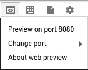
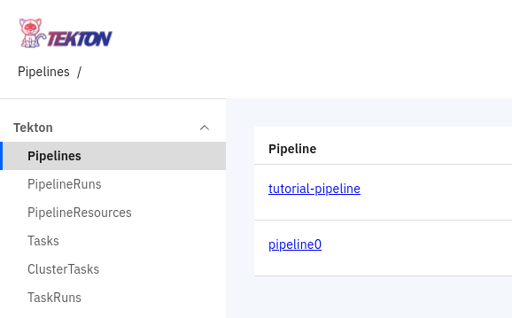
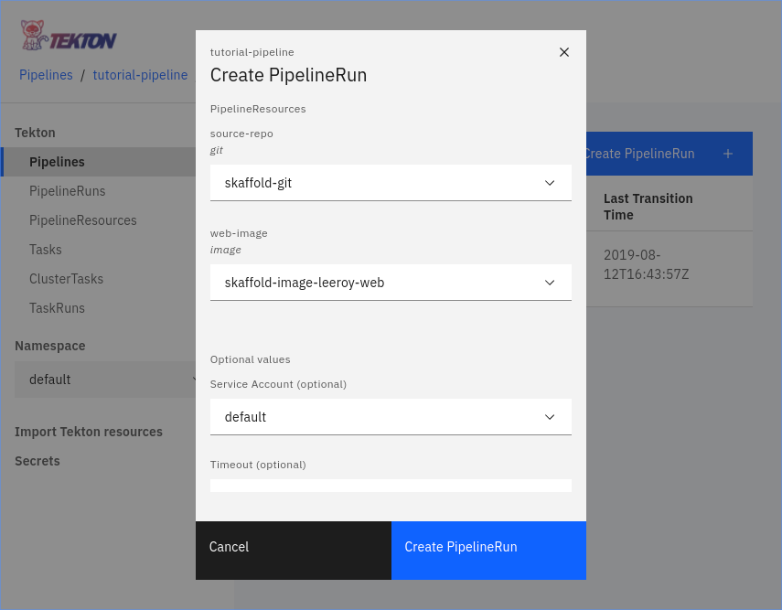
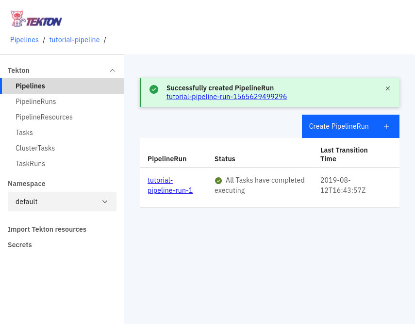

Based on https://github.com/tektoncd/pipeline/blob/master/docs/tutorial.md

# Tekton Workshop

## Clone the workshop code

1. Clone the sample code from GitHub.

    ```
    git clone https://github.com/viglesiasce/tekton-workshop
    cd tekton-workshop
    ```

## Create a Service Account for your pipelines to use

1. Create the GCP service account

    ```
    gcloud iam service-accounts create tekton --display-name tekton
    ```

1. Add permissions to the service account to be able to push images and deploy to your Kubernetes clusters.

    ```
    export GCP_PROJECT=$(gcloud config get-value project)
    gcloud projects add-iam-policy-binding ${GCP_PROJECT} \
           --member serviceAccount:tekton@${GCP_PROJECT}.iam.gserviceaccount.com \
           --role roles/storage.admin
    gcloud projects add-iam-policy-binding ${GCP_PROJECT} \
           --member serviceAccount:tekton@${GCP_PROJECT}.iam.gserviceaccount.com \
           --role roles/container.developer
    ```


## Create a Kubernetes Cluster

1. Enable the Kubernetes Engine API.

    ```
    gcloud services enable container.googleapis.com
    ```

1. Create the Google Kubernetes Engine Cluster that you'll use to deploy Tekton and its pipelines.

    ```shell
    gcloud config set compute/zone us-east1-d
    export GCP_PROJECT=$(gcloud config get-value project)
    gcloud container clusters create tekton-workshop \
          --service-account tekton@${GCP_PROJECT}.iam.gserviceaccount.com \
          --scopes cloud-platform \
          --machine-type n1-standard-2
    ```

## Installation

### Tekton

1. Install Tekton into your cluster.

    ```
    kubectl apply --filename https://storage.googleapis.com/tekton-releases/latest/release.yaml
    ```

### `tkn` CLI

1. Install the `tkn` CLI into your Cloud Shell.

    ```
    curl -LO https://github.com/tektoncd/cli/releases/download/v0.2.0/tkn_0.2.0_Linux_x86_64.tar.gz
    sudo tar xvzf tkn_0.2.0_Linux_x86_64.tar.gz -C /usr/local/bin/ tkn
    ```

### Installing Tekton Dashboard

1. Install the Tekton Dashboard to visualize your Tekton pipelines.

    ```
    kubectl apply --filename https://github.com/tektoncd/dashboard/releases/download/v0.1.0/release.yaml
    ```

## Hello World!


### Creating and running a task

1. First you'll create a task definition. In this case the task will echo "Hello Tekton Workshop!". 
   Note that the task step spec is a normal Kubernetes [Pod Spec definition](https://kubernetes.io/docs/reference/generated/kubernetes-api/v1.15/#podspec-v1-core).

    ```
    kubectl apply -f tasks/hello-world.yaml
    ```

1. You'll notice nothing is running in your cluster yet. This is because we haven't yet created the resource needed to invoke our task, the TaskRun.

    ```
    kubectl get pods
    ```

1. Apply the TaskRun in your cluster.

    ```
    kubectl apply -f taskruns/hello-world.yaml
    ```

1. Now you should see the task's pod running.

    ```
    kubectl get pods
    ```

1. When it completes you should be able to see the status of complete

    ```
    $  kubectl get pods
    NAME                                   READY   STATUS      RESTARTS   AGE
    echo-hello-world-task-run-pod-3ec0b2   0/1     Completed   0          28s
    ```

1. Now you can check the logs. We'll use the automatically added label `tekton.dev/task` to find a pod from our task.

    ```
    kubectl logs -l tekton.dev/task=echo-hello-world
    ```

### Creating a task with inputs and outputs

That was awesome! Kind of... We didn't really do much more than we could accomplish with a Kubernetes Job or Pod.

In this next section you'll create a reusable task that takes in inputs and creates outputs so that we can leverage the business logic of our task across different pipelines.

The inputs and outputs of `Tasks` are `PipelineResources`. There are a few types of pipeline resources that are baked into tekton, for example the `git` and `image`. The `git` resource is (as you'd expect) how we can get source code into our pipelines. The `image` resource allows us to either use or create a Docker image.

1. Create a `git` resource to clone the Skaffold project. We'll use a sample application from there to demonstrate how a pipeline is stitched together.

    ```
    kubectl apply -f resources/git-skaffold.yaml
    ```

1. Next, we'll create an `image` resource for the image we'll build from the sample application.

    ```
    export GCP_PROJECT=$(gcloud config get-value project)
    sed -i s/GCP_PROJECT/$GCP_PROJECT/ resources/image-leeroy-web.yaml
    kubectl apply -f resources/image-leeroy-web.yaml
    ```

1. Now that our resources have been created, lets create a `Task` that clones a git repo as an input
   and builds an image from it as an output.

   ```
   kubectl apply -f tasks/build-docker-image-from-git.yaml
   ```

//TODO diagram here that shows the mapping of these resources

1. Next we'll create the `TaskRun` that will map our resources to the task we just created.

    ```
    kubectl apply -f taskruns/leeroy-web-image-build.yaml
    ```

1. Now we can look at the logs from our image build job.

    ```
    kubectl logs -l tekton.dev/task=build-docker-image-from-git-source -c step-build-and-push
    ```

1. Once the task is complete we can look for our image in the registry.

    ```
    $  kubectl get pods
    NAME                                                     READY   STATUS      RESTARTS   AGE
    build-docker-image-from-git-source-task-run-pod-aaeab8   0/3     Completed   0          107s
    ```

    ```
    $  gcloud container images list
    NAME
    gcr.io/vic-tekton-1/leeroy-web
    ```

Now we are getting some real work done!

We were able to create a task that took a git repostiory as
an input and created a Docker image as its output. Then we created `PipelineResources` for the specific
repository and image that we wanted to build and mapped them to our `Task` using a `TaskRun`.


## Stringing tasks together with a `Pipeline`

Pipelines allow you to execute tasks in order and pass the ouptut of one to the input of the other.
In this part of the tutorial, you'll create a `Pipeline` that takes the output of our image build `Task`
and deploys it to our cluster. 

1. First, you'll need to give the pods that Tekton is creating the ability to deploy into the `default`
   namespace. Since we installed Tekton using the default configuration it will be deploying pods using 
   the default Kubernetes service account in the default namespace.

   ```
   kubectl create rolebinding --serviceaccount default:default --clusterrole admin default-admin
   ```

1. Lets create the `Task` that deploys to our cluster using `kubectl`.

    ```
    kubectl apply -f tasks/deploy-using-kubectl.yaml
    ```

1. Next, you'll create the `Pipeline` that takes the output of the image build and uses it as a parameter
   for the deployment `Task`.

   ```
   kubectl apply -f pipelines/tutorial-pipeline.yaml
   ```

1. Again you'll notice nothing happens when we created those resources. We need to create a `PipelineRun`
   to execute our `Pipeline`. The `PipelineRun` maps sets the parameters for our `Pipeline`. 

    ```
    kubectl apply -f pipelineruns/tutorial-pipeline-run-1.yaml
    ```

1. Check that PipelineRuns suceeded using `kubectl`.

    ```
    kubectl get pipelineruns
    ```

1. You can also take a look using the `tkn` CLI.

    ```
    tkn pipelinerun list
    ```
Congrats! You've run your first pipeline successfully.

1. Let's make sure our web app was deployed.

    ```
     $  kubectl logs -l app=leeroy-web
    2019/08/10 22:42:00 leeroy web server ready 
    ```

W00t!!11!!1!


## Exploring Tekton via the Dashboard

1. First set up port-forwarding to the Tekton Dashoard from you Cloud Shell environment.

    ```
    export TEKTON_POD=$(kubectl get pods -n tekton-pipelines -o jsonpath="{.items[0].metadata.name}" -l app=tekton-dashboard)
    kubectl port-forward --namespace tekton-pipelines $TEKTON_POD 8080:9097 >> /dev/null &
    ```
    
1. To open the Tekton Dashboard, click Web Preview in Cloud Shell and click Preview on port 8080.

    
    
1. When the UI opens, you may see an error due to the URL being malformed. Change the URL by removing `?authuser=0` and then reload the page.

1. Now you can click around to see the Pipelines, Tasks, etc that we've created in this tutorial.

1. Click the "Pipelines" button on the left and then the "tutorial-pipeline" link.

    

1. Now click the "Create PipelineRun" button and set the `skaffold-git` repo, `skaffold-image-leeroy-web` image, and `default` service account. Once those fields have been filled in, click the blue "Create PipelineRun".

    
    
1. You can now view your pipeline run in the UI by clicking the link in the green notification box.

    

# Conclusion

What have we built?

 * A task that can clone a Git repository and build a Docker image from it.
 * A task that can replace an image path in a Kubernetes YAML and then replace it
 * A parameterized pipeline that strings together our tasks and can be reused for many projects.
